<p align="center">
  
</p>

<p align="center">
  <strong>浙江大学 · 本科 / 硕士</strong><br />
  <sub>ZHEJIANG UNIVERSITY · BACHELOR'S &amp; MASTER'S</sub>
</p>

<p align="center">
  以求是为底色，向未知而行。<br />
  <strong>拥抱 AI，探索科技边界，把想象写成可以运行的现实。</strong>
</p>

<p align="center">
  <a href="#signal--关于我">ABOUT</a> &nbsp; / &nbsp;
  <a href="#experiments--实验档案">EXPERIMENTS</a> &nbsp; / &nbsp;
  <a href="https://github.com/zhongshiyu0129?tab=repositories">ALL REPOSITORIES ↗</a>
</p>

---

### SIGNAL / 关于我

我对智能、科学与创造的交汇处保持好奇。喜欢拆解复杂问题，也喜欢让一个尚未成形的念头，长成真正可用的工具。

从科研协作到内容创作，我正在探索 AI 如何进入真实工作流：让知识更容易被理解，让想法更快得到验证，让人有更多空间去判断和创造。

> **Seek truth. Build beyond.**  
> 在已知中求证，在未知中构建。

```text
education   →  Zhejiang University · Bachelor's + Master's
orientation →  AI × Science × Creative Technology
method      →  question → prototype → verify → iterate
horizon     →  beyond the obvious_
```

### EXPERIMENTS / 实验档案

一些正在把想法变成现实的实验。

<table>
  <tr>
    <td width="50%" valign="top">
      <sub>01 / AI × SCIENCE</sub>
      <h3><a href="https://github.com/zhongshiyu0129/spectra-workbench">Spectra Copilot ↗</a></h3>
      <p>面向材料、光学与热管理研究的光谱分析 Agent。把原始数据转化为可解释、可复算的图表与研究报告。</p>
      <p><code>Spectral Analysis</code> <code>Research Agent</code></p>
    </td>
    <td width="50%" valign="top">
      <sub>02 / AI × RESEARCH</sub>
      <h3><a href="https://github.com/zhongshiyu0129/lab-meeting-copilot">研行记 · RAN ↗</a></h3>
      <p>从语音转写、PPT、PDF 与组会讨论中，整理有出处、能复盘、可继续推进的研究行动记录。</p>
      <p><code>Knowledge Workflow</code> <code>Research Copilot</code></p>
    </td>
  </tr>
  <tr>
    <td width="50%" valign="top">
      <sub>03 / AI × CREATION</sub>
      <h3><a href="https://github.com/zhongshiyu0129/yanji-media-assistant">言己 · Yanji ↗</a></h3>
      <p>面向中文口播创作的 AI 工作台。把稿件重构、事实核验与发布准备串成可编辑、可追溯的创作流程。</p>
      <p><code>Creative Tools</code> <code>Human + AI</code></p>
    </td>
    <td width="50%" valign="top">
      <sub>04 / TECHNOLOGY × CYCLES</sub>
      <h3><a href="https://github.com/zhongshiyu0129/ai-boom-vs-dotcom">AI Boom vs. Dot-com ↗</a></h3>
      <p>把 AI 投资周期与互联网泡沫放在同一张研究地图上，观察技术叙事、盈利兑现与资本开支的关系。</p>
      <p><code>Technology Research</code> <code>Data &amp; Evidence</code></p>
    </td>
  </tr>
</table>

<details>
  <summary><strong>OPEN QUESTIONS / 留给未来的问题</strong></summary>

  <br />

  - AI 能否从回答问题，走向可靠地协助完成研究？
  - 科学、工程与创造之间，还能发生怎样的连接？
  - 当工具越来越聪明，人的判断力与想象力会走向哪里？

</details>

---

<p align="center">
  <sub>LESS NOISE. MORE SIGNAL.</sub><br />
  <strong>未来尚未命名，保持探索。</strong><br />
  <sub>zhongshiyu0129 · always in discovery</sub>
</p>
